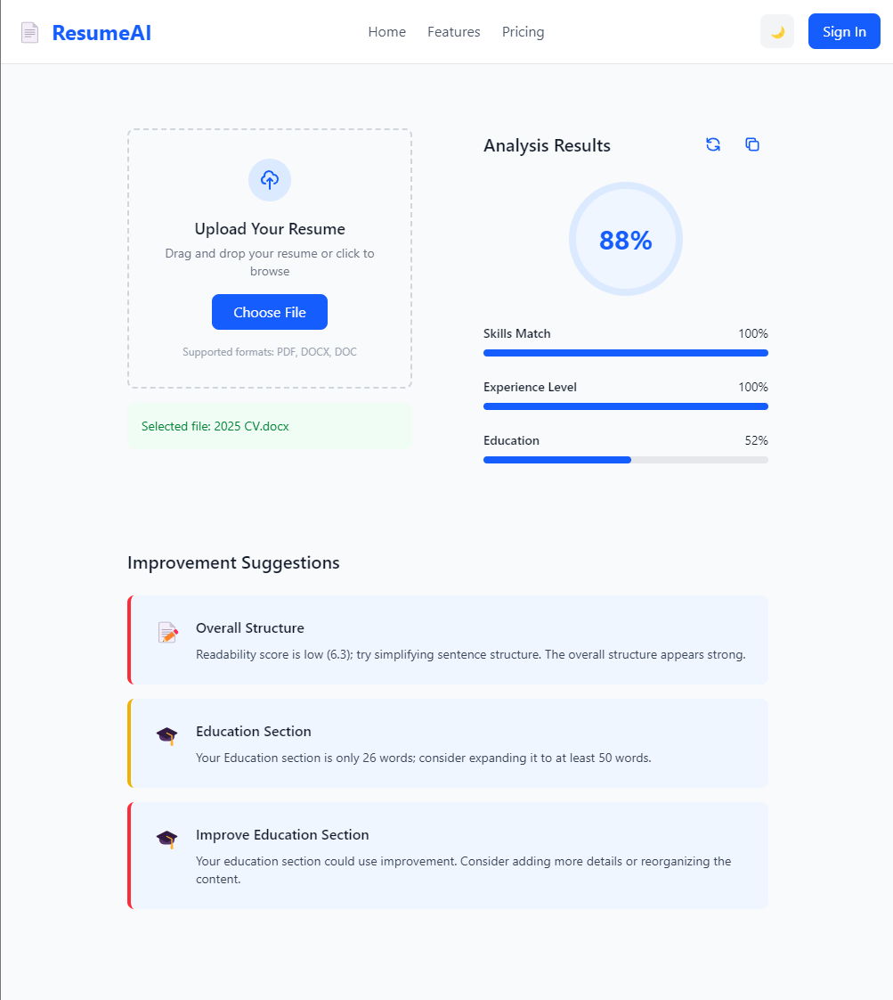

# Resume Analyzer Frontend

A modern web application built with Next.js and TypeScript that analyzes resumes and provides detailed feedback and improvement suggestions.



## Features

- 📄 Drag-and-drop resume upload
- 📊 Real-time resume analysis
- 💡 Smart improvement suggestions
- 📱 Responsive design
- 🌓 Light/dark mode support
- ⚡ Built with performance in mind

## Tech Stack

- [Next.js 15](https://nextjs.org/) - React framework with server-side rendering
- [TypeScript](https://www.typescriptlang.org/) - Type safety and better developer experience
- [Tailwind CSS](https://tailwindcss.com/) - Utility-first CSS framework
- [React Dropzone](https://react-dropzone.js.org/) - File upload handling
- [Bun](https://bun.sh/) - Fast JavaScript runtime and package manager

## Getting Started

### Prerequisites

- [Bun](https://bun.sh/) (latest version)

### Installation

1. Clone the repository:
```bash
git clone https://github.com/Kingdawnage/resume-analyzer.git
cd resume-analyzer
```

2. Install dependencies:
```bash
bun install
```

3. Start the development server:
```bash
bun run dev
```

4. Open [http://localhost:3000](http://localhost:3000) in your browser

## Project Structure

```
ra-frontend/
├── app/                    # Next.js app directory
│   ├── components/         # React components
│   │   ├── Navbar.tsx     # Navigation bar
│   │   ├── ResumeUpload.tsx    # File upload component
│   │   ├── AnalysisResults.tsx # Results display
│   │   ├── LoadingAnalysis.tsx # Loading states
│   │   └── ImprovementSuggestions.tsx
│   ├── globals.css        # Global styles
│   └── page.tsx           # Main page component
├── public/                 # Static assets
├── bun.lock               # Bun lock file
├── package.json           # Project dependencies
└── tsconfig.json          # TypeScript configuration
```

## Development

### Available Scripts

- `bun run dev` - Start development server with hot reload
- `bun run build` - Build production bundle
- `bun run start` - Start production server
- `bun run lint` - Run ESLint

### Environment Variables

Create a `.env.local` file in the root directory:

```env
NEXT_PUBLIC_API_URL=your_api_url_here
```

## Contributing

1. Fork the repository
2. Create your feature branch (`git checkout -b feature/amazing-feature`)
3. Commit your changes (`git commit -m 'Add some amazing feature'`)
4. Push to the branch (`git push origin feature/amazing-feature`)
5. Open a Pull Request

## License

This project is licensed under the MIT License - see the [LICENSE](LICENSE) file for details.

## Acknowledgments

- [Next.js Documentation](https://nextjs.org/docs)
- [Tailwind CSS Documentation](https://tailwindcss.com/docs)
- [React Dropzone Documentation](https://react-dropzone.js.org/)
